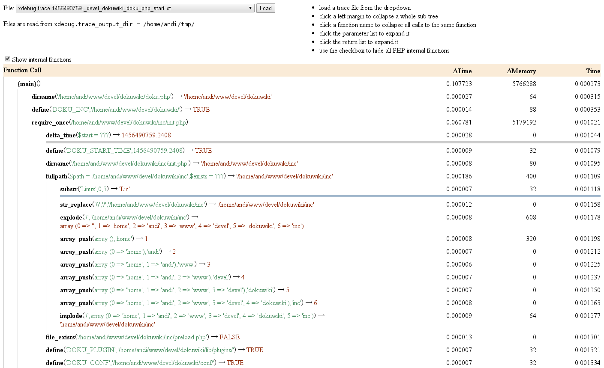

# XDebug Trace Tree

This is a simple PHP script to display XDebug traces in a tree like visualization. It can collapse parts
that you're not interested in when analysing the trace, making it much easier to follow the program flow.

Installation is simple. Just clone this dierectory to somewhere in your webserver and it should automatically
list all available trace files.

**Important:** this is meant a personal debugging - it should not be installed on a public webserver (Its passing
full file paths).

## Screenshot

## Recommended xdebug.ini setup:

Refer to https://xdebug.org/docs/stack_trace for detailled xdebug setup info.

    xdebug.trace_enable_trigger=1
    xdebug.trace_output_dir=/tmp/
    xdebug.trace_output_name=xdebug.trace.%t.%R
    xdebug.show_mem_delta=1
    xdebug.collect_params=4
    xdebug.collect_return=1
    xdebug.trace_format=1

## License

The MIT License (MIT)  
Copyright (c) 2016 Andreas Gohr <andi@splitbrain.org>

Permission is hereby granted, free of charge, to any person obtaining a copy of this software and associated documentation files (the "Software"), to deal in the Software without restriction, including without limitation the rights to use, copy, modify, merge, publish, distribute, sublicense, and/or sell copies of the Software, and to permit persons to whom the Software is furnished to do so, subject to the following conditions:

The above copyright notice and this permission notice shall be included in all copies or substantial portions of the Software.

THE SOFTWARE IS PROVIDED "AS IS", WITHOUT WARRANTY OF ANY KIND, EXPRESS OR IMPLIED, INCLUDING BUT NOT LIMITED TO THE WARRANTIES OF MERCHANTABILITY, FITNESS FOR A PARTICULAR PURPOSE AND NONINFRINGEMENT. IN NO EVENT SHALL THE AUTHORS OR COPYRIGHT HOLDERS BE LIABLE FOR ANY CLAIM, DAMAGES OR OTHER LIABILITY, WHETHER IN AN ACTION OF CONTRACT, TORT OR OTHERWISE, ARISING FROM, OUT OF OR IN CONNECTION WITH THE SOFTWARE OR THE USE OR OTHER DEALINGS IN THE SOFTWARE.